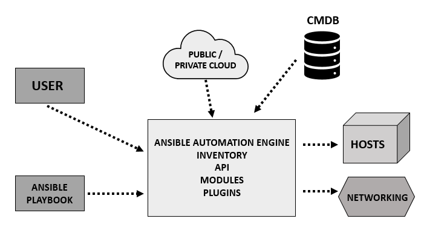

# What is Infrastructure as Code (IaC)
IaC is the managing and provision of infrastructure through code instead of through manual processes. 

### The benefits of using IaC
1) Consistency: using code to define infrastructure allows to ensure that all environments from development to production are consistent and identical.
2) Version control: Infrastructure code can be version controlled. It allows to track changes, roll back to previous versions and collaborate. 
3) Reproducibility: IaC allows to recreate environment quickly and easily, making it straight forward to create development, testing and staging environments that matches the production environment. 
4) Automation: IaC allows to automate the process of provisioning and managing infrastructure. This leads to save time and effort. 
5) Scalability: IaC provides a scalable approach to managing resources without increasing the complexity of manual setup.

## Ansible
An imperative IaC tool that uses simple, human-readable YAML files for defining tasks to be executed on target systems

