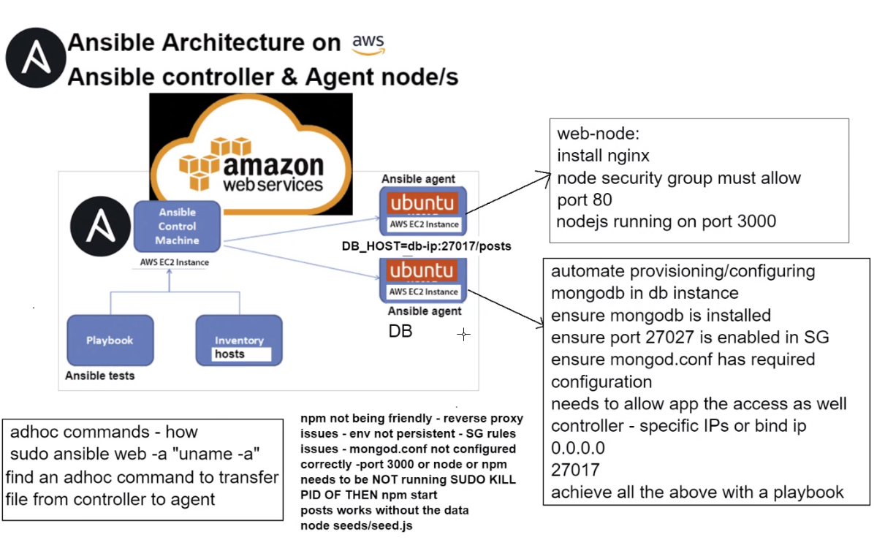

# Ansible playbooks 



## Adhoc commands
Adhoc commands allow to run simple tasks or commands on remote hosts without the need to write a full playbook.

- Check system info
    ```
    sudo ansible web -a "uname -a"
    ```

- Check the system date
    ```
    sudo ansible web -a "date"
    ```

- Check RAM
    ```
    sudo ansible web -a "free"
    ```

- list contents of pwd
    ```
    sudo ansible web -a "ls -a"
    ```

# Sparta App

### Install Nginx

```yaml
# YAML file start --- three dashes

# Why yaml
# why playbooks
# create a playbook to install ingnx in web node

---

# which host to perform the task must match the name of the host in the hosts file
- hosts: web

# see the log by gathering facts
  gather_facts: yes

# root or admin access
  become: true

# add the instructions - install nginx: in web node
  tasks:
  - name: Installing Nginx
    apt: pkg=nginx state=present

# check status of nginx is actively running
# adhoc command to check the status

# configure reverse proxy

  - name: Customize Nginx default configuration file
    lineinfile:
      path: /etc/nginx/sites-available/default
      regexp: '^(\s*try_files.*)$'
      line: '        proxy_pass http://localhost:3000;'

# restart nginx

  - name: Restart Nginx service
    service:
      name: nginx
      state: restarted
```

### Install nodejs and start the app
```yaml
---
# which host to perform
- hosts: web

# see the log by gathering facts
# gathering_facts: yes

# admin access
  become: true

# install nodejs
  tasks:
  # add the instructions  -  install node 12 with pm2 and run the app
  - name: Installing node v 12the gog key for nodejs
    apt_key:
      url: "https://deb.nodesource.com/gpgkey/nodesource.gpg.key"
      state: present

  - name: Add NodeSource repository
    apt_repository:
      repo: "deb https://deb.nodesource.com/node_12.x {{ ansible_distribution_release }} main"
      state: present


  - name: Clone the Git repository
    git:
      repo: https://github.com/jungjinggg/tech241_sparta_app.git
      dest: /home/ubuntu/app

    become: yes

  - name: Install Node.js
    apt:
      name: nodejs
      state: present
      update_cache: yes

  - name: Install PM2
    npm:
      name: pm2
      global: yes
      state: present
      version: "4.5.6"

  - name: Install app dependencies
    command: npm install
    args:
      chdir: /home/ubuntu/app/app/

  - name: Stop PM2 processes
    shell: pm2 kill

  - name: Start the Node.js app
    shell: pm2 start app.js
    args:
      chdir: /home/ubuntu/app/app
```


## MongoDB

This command allows to see the abstracted logs; is used to check where an error occurs
```
sudo ansible-playbook mongodb-playbook.yml -vvv
```

### Installing mongodb
```yaml
---
# create a playbook to install mongodb in db-instance

# host
- hosts: db

# get logs
  gather_facts: yes

# admin access
  become: true

# provide instructions - task: install mongodb
  tasks:

# install mongodb
  - name: Installing MongoDB
    apt: pkg=mongodb state=present

# ensure the db is running

# check the status if its running with adhoc commands

# add steps to make required changes to mongod.conf to change ip
  - name: Modify mongod.conf to change bindIp
    lineinfile:
      path: /etc/mongodb.conf
      regexp: '^bind_ip'
      line: 'bind_ip = 0.0.0.0'

# restart mongodb
  - name: Restart MongoDB service
    service:
      name: mongodb
      state: restarted

# enable mongodb
  - name: Enable mongod service
    service:
      name: mongodb
      state: started
      enabled: yes
```

### Full Node.js playbook after installing mongodb
```yaml
---
# which host to perform
- hosts: web

# see the log by gathering facts
#  gathering_facts: yes

# admin access
  become: true

# install nodejs
  tasks:
  # add the instructions  -  install node 12 with pm2 and run the app
  - name: Installing node v 12the gog key for nodejs
    apt_key:
      url: "https://deb.nodesource.com/gpgkey/nodesource.gpg.key"
      state: present
  
  - name: Add NodeSource repository
    apt_repository:
      repo: "deb https://deb.nodesource.com/node_12.x {{ ansible_distribution_release }} main"
      state: present
  
  # Clone the app 
  - name: Clone the Git repository
    git:
      repo: https://github.com/jungjinggg/tech241_sparta_app.git
      dest: /home/ubuntu/app
  
  # Set env var of HOST_DB
  - name: Add DB_HOST to /etc/environment
    lineinfile:
      path: /etc/environment
      line: 'DB_HOST="mongodb://172.31.32.21:27017/posts"'
  
  # Install node.js
  - name: Install Node.js
    apt:
      name: nodejs
      state: present
      update_cache: yes
  
  # Install pm2
  - name: Install PM2
    npm:
      name: pm2
      global: yes
      state: present
      version: "4.5.6"
  
  # Install npm
  - name: Install app dependencies
    command: npm install
    args:
      chdir: /home/ubuntu/app/app/

  # Seeding database to fetch posts
  - name: Seeding database
    command: node seeds/seed.js
    args:
      chdir: /home/ubuntu/app/app/
  
  # Kill pm2
  - name: Stop PM2 processes
    shell: pm2 kill

  # Start the app
  - name: Start the Node.js app
    command: pm2 start app.js
    args:
      chdir: /home/ubuntu/app/app

```
To check if mongodb running using adhoc command
```
sudo ansible db -a "systemctl status mongodb"
```