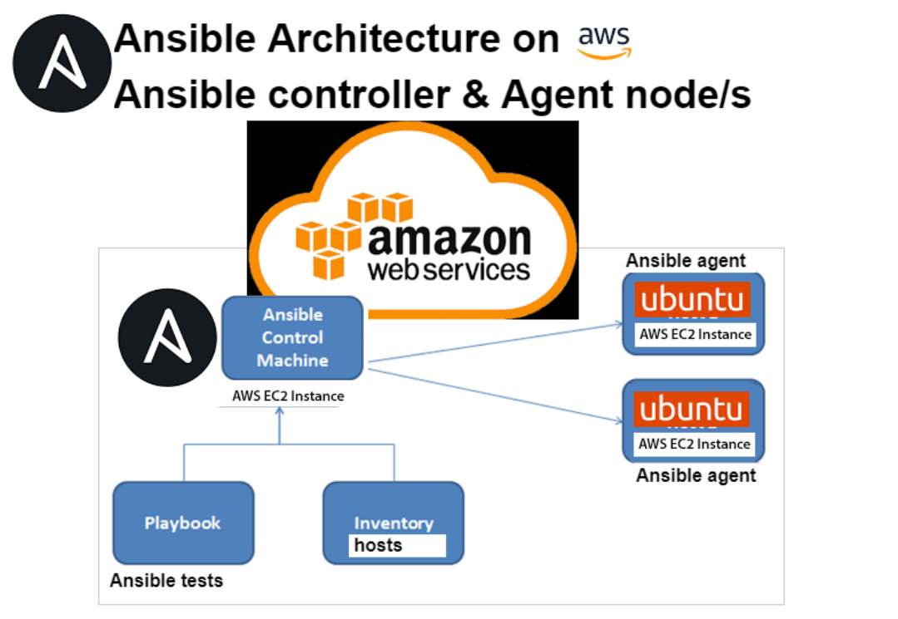
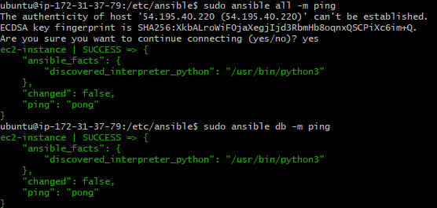

# Ansible
Ansible is a configuration tool that orchestrates the entire application environment. It is simple and angentless which means the nodes ansible manages do not require any software to be installed on them.



## On ansible terminal
1) ssh
   ```bash
   ssh -i "~/.ssh/tech241.pem" ubuntu@ec2-3-253-131-9.eu-west-1.compute.amazonaws.com 
   ```
2) update
   ```bash
   sudo apt update -y
   ```
3) allow to enhnace the package management capabilities by enabling easy management of additional software sources and repositories
   ```bash
   sudo apt-get install software-properties-common -y
   ```
4) add the ansible repository (ppa - personal package archive)
   ```bash
   sudo apt-add-repository ppa:ansible/ansible
   ```
5) update again
   ```bash
   sudo apt update -y
   ```
6) install ansible
   ```bash
   sudo apt install ansible -y
   ``` 
7) check ansible version
   ```bash
   sudo ansible --version
8) cd to .ssh file
    ```bash
    cd ~/.ssh
    ```   
9) add private key
   ```bash
   sudo nano tech241.pem
   ```
10) change file permission to read only
    ```bash
    sudo chmod 400 tech241.pem
    ```
11) ssh into app vm in the controller terminal, inside .ssh folder
    ```bash
    sudo ssh -i "tech241.pem" ubuntu@ec2-52-209-107-56.eu-west-1.compute.amazonaws.com
    ```
12) cd /etc/ansible
    ```bash
    cd /etc/ansible
    ```
13) edit hosts file to check if app vm receives a response 
    ```bash
    sudo nano hosts
    ```
14) add the command to the hosts file 
    ```
    [web]
    ec2-instance ansible_host=34.240.87.96 ansible_user=ubuntu ansible_ssh_private_key_file=~/.ssh/tech241.pem
    ```
15) check if app vm receives a response  
    ```bash
    sudo ansible web -m ping
    ```
### If setup correctly, should be able to see the status
This means if the hosts respond successfully, Ansible will display a success message indicating that the hosts are reachable


## On App and DB VM terminals
1) sudo apt update -y
2) sudo apt upgrade -y

